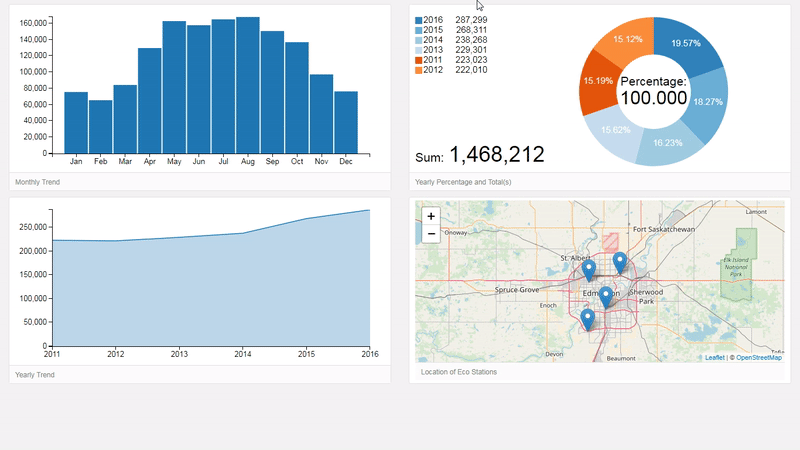

# Eco Station II
 
An improvement of [Eco Station I](https://github.com/Edmonton-Open-Data/Edmonton-Eco-Stations#eco-station-monthly-users-dashboard) 
Best viewed in: Google Chrome (Desktop and mobile Dashboard) 
To-do: Apply [Joey Cherdarchuk ](https://www.darkhorseanalytics.com/blog/salvaging-the-pie?rq=data%20looks%20better%20naked) findings

[***CLICK ME FOR DASHBOARD II***](https://edmonton-open-data.github.io/Eco-Station-II/)
